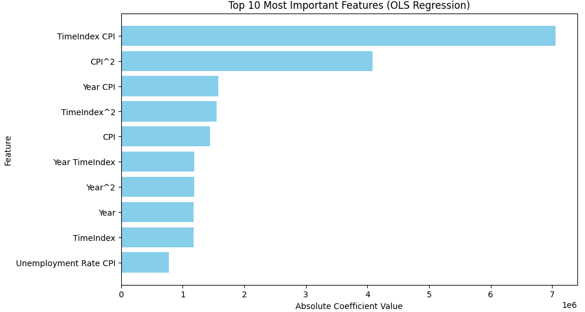
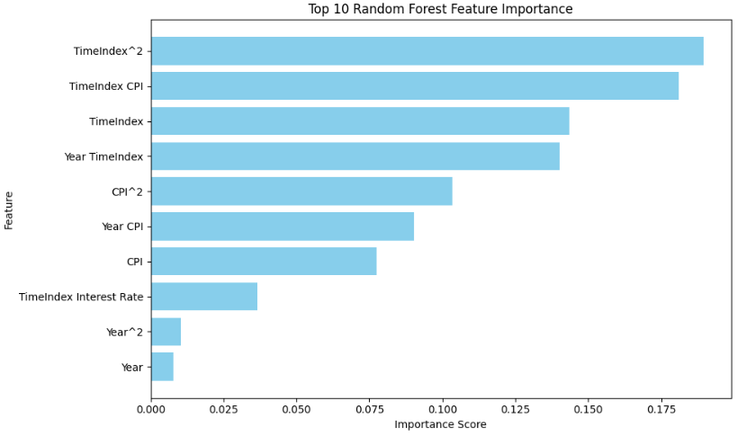
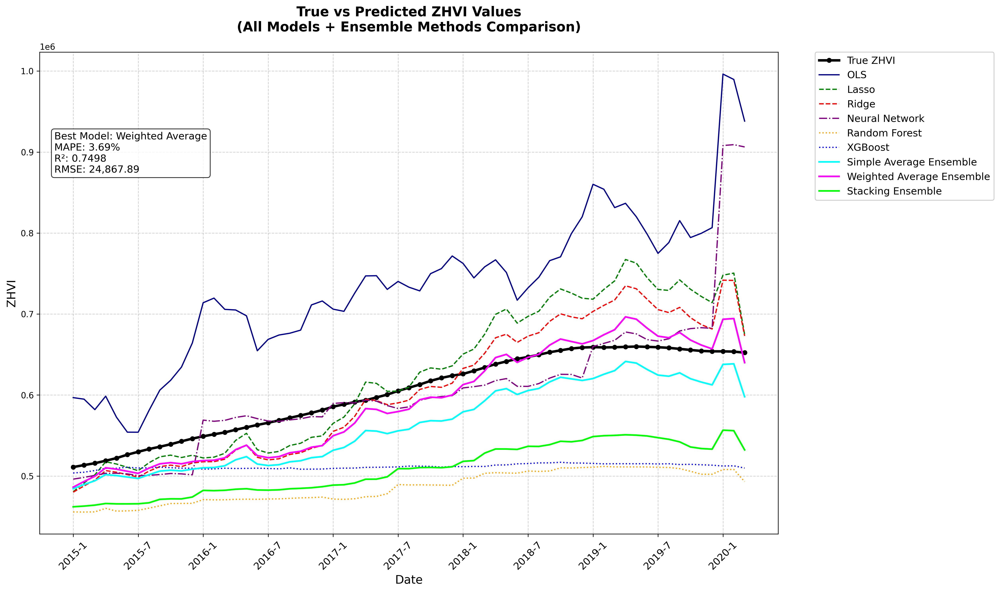

# DSCI 441 Project - Forecasting Zillow Home Value Index(ZHVI) Using Various Regression Models
##### By Nicolas Kozachuk

The Zillow Home Value Index (ZHVI) is a seasonally adjusted measure of the typical home value and market changes across a given region and housing type. This project uses monthly ZHVI time series data from 1996 to 2020, as well as numerous economial features to predict future ZVHI values. Various regression prediction techniques will be implemented and compared.

---

## Table of Contents
  - [Abstract](#abstract)
  - [Installation](#installation)
  - [Usage](#usage)
  - [Packages](#packages) 
  - [Datasets](#datasets)
  - [Features](#features)
  - [Methodology](#methodology)
  - [Results](#results)


---

## Abstract
This project aims to predict the Zillow Home Value Index (ZHVI) for New York City by leveraging historical monthly housing data and key economic indicators, with an additional comparison of various regression models. The ZHVI is a crucial measure of typical home values and market changes, providing valuable insights for real estate stakeholders. The ZHVI dataset spans from 1996 to 2020 and includes ZHVI values, and additional datasets are imported and utilized for corresponding dates with features such as unemployment rates, consumer price index (CPI), gross domestic product (GDP) growth rate, and interest rates. These indicators reflect the health of the economy, inflation, and borrowing costs, which are essential for understanding housing market trends. The primary objective is to forecast future ZHVI values using these economic and historical housing data. To achieve this, three regression models, Ordinary Least Squares (OLS), Lasso, and Ridge Regression are employed and compared. This study not only provides a robust framework for predicting ZHVI but also offers actionable insights through model comparison and model coefficient analysis. The methodology and findings can be extended to other regions and adapted for real-time prediction capabilities, enhancing its applicability in the real estate market.


## Installation

For simplest installation, one can simply open the Jupyter Notebook in Google colab and run all. The code will automatically download any neccessary libraries and datasets used.

If one wants to run the code locally, one can retrieve the code by running 
```bash
# Example installation commands
git clone https://github.com/ngk324/DSCI441_Project_House_Price_Prediction.git
cd DSCI441_Project_House_Price_Prediction
```

## Usage
After installation or opening on Google Colab, one can simply run all on the code. The datasets will be automatically downloaded from Kaggle and used. If running local, one can simply run the python file using their standard method for running Python code. 

## Packages

***Core Packages***
- Python 3.x
- pandas
- numpy
- matplotlib
- scikit-learn
- tensorflow
- keras-tuner
- xgboost
- statsmodels
- joblib
- tabulate

***Optional/Development Packages***
- streamlit
- kagglehub
- IPython
- warnings
- os
- math
- random

***Installation Commands***

```bash
# Core machine learning packages
pip install pandas numpy matplotlib scikit-learn tensorflow keras-tuner xgboost statsmodels joblib tabulate

# Optional packages
pip install streamlit kagglehub

# For Jupyter notebook functionality
pip install IPython
```


## Datasets
- The ZHVI data comes from [this](https://www.kaggle.com/datasets/paultimothymooney/zillow-house-price-data?select=Sale_Prices_City.csv) Kaggle dataset.
  - This dataset in csv format contains multiple different housing information data, such as Median Price and ZHVI, and is broken up by per USA City or US State and by number of bedrooms. The range of dates is monthly from January 1996 to March 2020.
  -  The data used is the City ZHVI for all sized homes. 
- The Unemployment Rate data comes from [this](https://www.kaggle.com/datasets/axeltorbenson/unemployment-data-19482021) Kaggle Dataset
  - This dataset in csv format contains unemployment rates overall, as well as for various demographic group, broken up by age and sex, with monthly entries from 1948 to 2021.
  - The data used is the overall unemployment rate by month from January 1996 to March 2020, in order to match the ZHVI data range.
- The Inflation Rate data comes from [this](https://www.kaggle.com/datasets/varpit94/us-inflation-data-updated-till-may-2021) Kaggle dataset.
  - This dataset in csv format contains the monthly Consumer Price Index(which is directly correlated to inflation) from January 1912 to January 2021.
  - The data used is the montly CPI from January 1996 to March 2020, in order to match the ZHVI data range.
- The Interest Rate data comes from [this](https://www.kaggle.com/datasets/raoofiali/us-interest-rate-weekly) Kaggle dataset.
  - This dataset in xlsx format and contains the weekly interest rate from 1971 to 2024.
  - The data used is the weekly Interest Rate data(averaged over each month), in order to get montly Interest Rate from January 1996 to March 2020, in order to match the ZHVI data range.
- The GDP Growth Rate data comes from [this](https://www.kaggle.com/datasets/rajkumarpandey02/economy-of-the-united-states) Kaggle dataset.
  - This dataset contains various GDP statistics, as well as the interest rate each year from 1980 to 2024.
  - The data used is the GDP growth rate each year from 1996 to 2020. 

## Features
The city of focus is New York City, as it is the largest city in the USA. The data used as the input is the data in the range of January 1996 to December 2012, thus the data in the range of January 2013 to March 2020 is used for prediction. The features used for this model are the monthly values.
- **Zillow Home Value Index(ZHVI)**: *Zillow's created measure of the typical home value and market changes across a given region and housing type.*
  
- **Unemployment Rate**: *the percentage of people in the labor force who are unemployed. A key economic indicator that reflects the health of a nation's job market and economy*
 

It can be seen that there is a clear inverse relationship between the ZHVI and the unemployment rate. This makes sense as when unemployment increases, the average person will have less money and the housing market will decline.

- **Consumer Price Index(CPI)**: *measure of the average change over time in the prices paid by consumers for a representative basket of consumer goods and services. The CPI measures inflation as experienced by consumers in their day-to-day living expenses.*


The overall trend of the ZHVI and CPI are both linearly increasing, and at about the same rate.

- **Gross Domestic Product(GDP) Growth Rate**: *measures the percentage change in a country's GDP over a specific period, typically a year, indicating the rate at which an economy is expanding or contracting.*


There is no clear visual overall relationship between ZHVI and GDP growth rate, but one should note that for the most part, the CPI is positive when the ZHVI is increasing, and the CPI is negative when the ZHVI is negative.

- **Interest Rate**: *the cost of borrowing money, expressed as a percentage of the principal amount borrowed. Changes in interest rates, set by central banks, influence borrowing costs, consumer spending, and overall economic activity.*


There is no clear visual overall relationship between ZVHI and Interest rate.

## Methodology
Ordinary least squares regression, Lasso regression, and Ridge Regression are all performed and compared. Alpha parameter tuning is performed for Lasso regression and Ridge Regression to find the optimal alpha values.

Future work will include Random Forest Regression and Neural Network Regressor implementation and results.

**Feature Engineering**

- **Polynomial Features (degree = 2)**: Improves the model by capturing nonlinear relationships and increasing flexibility. Effects OLS, Lasso, and Ridge differently due to their regularization properties.

- **Feature Scaling**: Ensures all features contribute equally to the model and improves the performance of Ridge and Lasso. Features are transformed to be on a similar scale, so regularization penalty is applied equally. This allows model to learn more accurate and interpretable coefficients and helps with numerical stability and convergence.


Alpha parameter tuning yielded that the best alpha for Lasso Regression for this task is 50.


Alpha parameter tuning yielded that the best alpha for Ridge Regression for this task is 0.25.

### Milestone 2 Methodology
**Neural Network Hyperparameter Tuning** 
\
\
Configuration Options
| Hyperparameter        | Search Space                  | Type       | Description |
|-----------------------|-------------------------------|------------|-------------|
| **First Layer Units** | 64, 128, 192, 256             | Integer    | Number of neurons in the initial dense layer. Larger values increase capacity but risk overfitting. Step size of 64 provides gradual scaling options. |
| **Number of Layers**  | 1-3                           | Integer    | Controls model depth. More layers can capture complex patterns but may be harder to train. Limited to 3 hidden layers for this architecture. |
| **Hidden Layer Units**| 32, 64, 96, 128               | Integer    | Neurons in subsequent hidden layers. Typically decreases from first layer (pyramid pattern). Step size of 32 allows gradual reduction. |
| **Dropout Rates**     | 0.0-0.5 (step 0.1)            | Float      | Fraction of neurons randomly deactivated during training. Regularization technique to prevent overfitting. 0.0 = no dropout, 0.5 = half neurons dropped. |
| **Learning Rate**     | 0.01, 0.001, 0.0001           | Choice     | Step size for weight updates. Lower values train slower but more precisely. Adam optimizer adapts rates per-parameter. |
| **Batch Size**        | 32                            | Fixed      | Number of samples per gradient update. Fixed for memory efficiency and stable training. Not tuned in this configuration. |
| **Epochs**           | 100                           | Fixed      | Maximum training iterations. Early stopping may terminate earlier if validation loss plateaus. |
| **Early Stopping**    | Patience: 10                  | Fixed      | Stops training if no improvement in validation loss for 10 epochs. Restores weights from best epoch to prevent overfitting. |

Tuning Configuration
| Setting               | Value                                 |
|-----------------------|---------------------------------------|
| Tuning Algorithm      | Random Search                         |
| Max Trials            | 20                                    |
| Executions per Trial  | 2                                     |
| Validation Split      | 20%                                   |
| Objective Metric      | Validation Loss (MSE)                 |

Neural Network Architecture found via Hyperparameter Tuning
| Configuration     | Value       | 
|-------------------|-------------|
| **Hidden Layers**     | 3           | 
| **Layer Dimensions**  | 128, 64, 32 | 
| **Dropout**          | 0.2         | 
| **Learning Rate**    | 0.001       | 

\ 
\
**XGBoost Hyperparameter Tuning** 
\
\
Configuration Options
| Hyperparameter         | Search Space              | Type     | Description                                                                 |
|------------------------|---------------------------|----------|-----------------------------------------------------------------------------|
| **max_depth**          | 3, 5, 7                   | Integer  | Maximum tree depth (complexity control)                                     |
| **learning_rate**      | 0.01, 0.05, 0.1           | Float    | Step size shrinkage (eta)                                                   |
| **subsample**          | 0.8, 0.9, 1.0             | Float    | Fraction of samples used per tree (prevents overfitting)                    |
| **colsample_bytree**   | 0.8, 0.9, 1.0             | Float    | Fraction of features used per tree (feature randomness)                     |
| **gamma**              | 0, 0.1, 0.2               | Float    | Minimum loss reduction required for node split (regularization)             |
| **min_child_weight**   | 1, 3, 5                   | Integer  | Minimum sum of instance weight needed in a child (controls tree growth)     |

Tuning Configuration
| Setting                | Value                     |
|------------------------|---------------------------|
| Tuning Algorithm       | RandomizedSearchCV        |
| Number of Iterations   | 20                        |
| Cross-Validation       | TimeSeriesSplit (n=3)     |
| Scoring Metric         | Negative MAPE             |
| Fixed Parameters       | n_estimators=100, random_state=42 |

XGBoost Architecture found via Hyperparameter Tuning
| Hyperparameter         | Optimal Value |
|------------------------|---------------|
| **subsample**          | 0.8           | 
| **min_child_weight**   | 1             | 
| **max_depth**          | 5             | 
| **learning_rate**      | 0.1           | 
| **gamma**              | 0.2           | 
| **colsample_bytree**   | 0.9           | 

**Random Forest Hyperparameter Tuning** 
\
\
Configuration Options
| Hyperparameter         | Search Space              | Type     | Description                                                                 |
|------------------------|---------------------------|----------|-----------------------------------------------------------------------------|
| **n_estimators**       | 100, 200, 300             | Integer  | Number of trees in the forest                                               |
| **max_depth**          | None, 10, 20, 30          | Integer  | Maximum depth of each tree (None=unlimited)                                 |
| **min_samples_split**  | 2, 5, 10                  | Integer  | Minimum samples required to split a node                                    |
| **min_samples_leaf**   | 1, 2, 4                   | Integer  | Minimum samples required at each leaf node                                  |

Tuning Configuration
| Setting                | Value                     |
|------------------------|---------------------------|
| Tuning Algorithm       | GridSearchCV              |
| Search Strategy        | Exhaustive grid search    |
| Cross-Validation       | 5-fold                    |
| Scoring Metric         | Negative MSE              |
| Fixed Parameters       | random_state=42           |

Random Forest Best Parameters
| Parameter           | Value  |
|---------------------|--------|
| max_depth           | None   |
| min_samples_leaf    | 1      |
| min_samples_split   | 2      |
| n_estimators        | 300    |

## Results

| Model | RMSE    | MAPE    | MAE     | R^2     |
|-------|---------|---------|---------|---------|
|OLS   |  1.31e+5    | 18.53% | 1.12e+5 | -0.143|           
|Ridge |3.46e+4|    4.82%    | 2.89e+4| 0.847 |
|Lasso | 4.4e+4    | 5.49% |   3.40e+4 | 0.785 |


The results show that Ridge Regression outperforms both OLS and Lasso Regression in predicting ZHVI (Zillow Home Value Index). Ridge achieves the lowest RMSE (3.46e+4) and MAPE (4.82%), along with the highest R² (0.847), suggesting it provides the best balance between bias and variance. Lasso Regression performs better than OLS but falls slightly short of Ridge regression, with higher RMSE (4.4e+4) and MAPE (5.49%) and a lower R² (0.785). OLS performs the worst, with significantly higher errors (RMSE: 9.2e+4, MAPE: 13.43%) and the lowest R² (0.301), indicating it struggles to capture the underlying patterns in the data. Overall, Ridge is the most effective model for this task.



The image shows the top 10 most important features in the OLS regression model, ranked by their absolute coefficient values. The results highlight that CPI features and time-related features (such as Year and TimeIndex) are the most influential in predicting the Zillow Home Value Index (ZHVI). Specifically, the top features include interaction terms like TimeIndex CPI and Year CPI, as well as polynomial terms like CPI^2 and TimeIndex^2. These features dominate the model, indicating that inflation (CPI) and temporal trends play a critical role in determining housing prices for prediction using OLS regression.

The importance of CPI features reflects the impact of inflation on housing costs, as rising prices for goods and services often lead to higher home values. Meanwhile, time-related features like Year and TimeIndex capture long-term trends and seasonal patterns in the housing market, such as gradual appreciation or cyclical fluctuations. The presence of interaction terms (e.g., TimeIndex CPI) suggests that the relationship between inflation and housing prices evolves over time, further emphasizing the dynamic nature of the housing market. Overall, these results align with economic principles, demonstrating that inflation and time are key drivers of housing price changes.


The image shows the top 10 most important features in the Ridge regression model, ranked by their absolute coefficient values. The results highlight that time-related features (such as TimeIndex and Year) and economic indicators (such as Unemployment Rate and CPI) are the most influential in predicting the Zillow Home Value Index (ZHVI). Specifically, the top features include interaction terms like TimeIndex Unemployment Rate and Unemployment Rate Interest Rate, as well as polynomial terms like Unemployment Rate^2 and Year^2. These features dominate the model, indicating that temporal trends and economic conditions play a critical role in determining housing prices for predicting using Ridge regression.

The importance of time-related features like TimeIndex and Year reflects the impact of long-term trends and seasonal patterns on housing prices, such as gradual appreciation or cyclical fluctuations. Meanwhile, economic indicators like Unemployment Rate and CPI capture the influence of labor market conditions and inflation on housing costs. The presence of interaction terms (e.g., TimeIndex Unemployment Rate) suggests that the relationship between economic conditions and housing prices evolves over time, further emphasizing the dynamic nature of the housing market. Overall, these results align with economic principles, demonstrating that both time and economic factors are key drivers of housing price changes.


The image shows the top 10 most important features in the Lasso regression model, ranked by their absolute coefficient values. The results highlight that time-related features (such as TimeIndex and Year) and economic indicators (such as Unemployment Rate and CPI) are the most influential in predicting the Zillow Home Value Index (ZHVI). Specifically, the top features include interaction terms like TimeIndex Unemployment Rate and TimeIndex CPI, as well as polynomial terms like TimeIndex^2 and Unemployment Rate^2. These features dominate the model, indicating that temporal trends and economic conditions play a critical role in determining housing prices when predicting using Lasso regression.

The importance of time-related features like TimeIndex and Year reflects the impact of long-term trends and seasonal patterns on housing prices, such as gradual appreciation or cyclical fluctuations. Meanwhile, economic indicators like Unemployment Rate and CPI capture the influence of labor market conditions and inflation on housing costs. The presence of interaction terms (e.g., TimeIndex Unemployment Rate) suggests that the relationship between economic conditions and housing prices evolves over time, further emphasizing the dynamic nature of the housing market. Overall, these results align with economic principles, demonstrating that both time and economic factors are key drivers of housing price changes.

### Milestone 2 Results



## Model Performance Comparison (Sorted by MAPE)

| Model               | MAE        | RMSE       | MAPE   | R²      |
|---------------------|------------|------------|--------|---------|
| Weighted Average    | 21,694.88  | 24,867.89  | 3.69%  | 0.7498  |
| Neural Network      | 27,119.78  | 54,902.67  | 4.47%  | 0.1694  |
| Ridge               | 28,891.17  | 34,587.00  | 4.82%  | 0.8469  |
| OLS                 | 112,483.28 | 130,532.10 | 5.36%  | -0.1439 |
| Lasso               | 34,030.37  | 44,618.02  | 5.49%  | 0.7853  |
| Simple Average      | 38,783.54  | 40,336.11  | 6.47%  | 0.3417  |
| XGBoost             | 90,674.54  | 102,249.80 | 14.49% | -3.2301 |
| Stacking Ensemble   | 94,035.58  | 96,290.63  | 15.44% | -2.7514 |
| Random Forest       | 102,800.77 | 110,934.40 | 17.08% | -2.391  |



