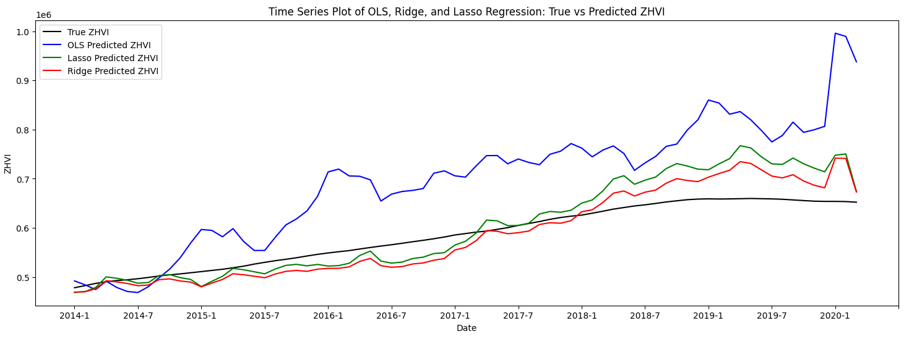

# DSCI 441 Project - Forecasting Zillow Home Value Index(ZHVI) 
##### By Nicolas Kozachuk

The Zillow Home Value Index (ZHVI) is a seasonally adjusted measure of the typical home value and market changes across a given region and housing type. It reflects the value of homes in the 35th to 65th percentile range. This project uses monthly ZHVI time series data from 1996 to 2020, as well as numerous economial features to predict how future ZVHI values. Various regression prediction techniques will be implemented and compared.

---

## Table of Contents
  - [Installation](#installation)
  - [Usage](#usage)
  - [Datasets](#datasets)
  - [Features](#features)
  - [Methodology](#methodology)
  - [Results](#results)


---

## Installation

For simplest installation, one can simply open the Jupyter Notebook in Google colab and run all. The code automatically download any neccessary libraries and datasets used.

If one wants to run the code locally, one can retrieve the code by running 
```bash
# Example installation commands
git clone https://github.com/ngk324/DSCI441_Project_House_Price_Prediction.git
cd DSCI441_Project_House_Price_Prediction
```

## Usage
After installation or opening on Google Colab, one can simply run all on the code. The datasets will be automatically downloaded from Kaggle and used.

## Datasets
- The ZHVI data comes from [this](https://www.kaggle.com/datasets/paultimothymooney/zillow-house-price-data?select=Sale_Prices_City.csv) Kaggle dataset.
  - The dataset in csv format contains multiple different housing information data, such as per USA City or US State, by number of bedrooms, and Median Price or ZVHI. The range of dates is monthly from January 1996 to March 2020.
  -  The data used is the City ZHVI for all sized homes. 
- The Unemployment Rate data comes from [this](https://www.kaggle.com/datasets/axeltorbenson/unemployment-data-19482021) Kaggle Dataset
  - The dataset in csv format contains unemployment rates overall, and for various demographic group, broken up by age and sex, monthly from 1948 to 2021.
  - The data used is the overall unemployment rate by month from January 1996 to March 2020, in order to match the ZHVI data range.
- The Inflation Rate data comes from [this](https://www.kaggle.com/datasets/varpit94/us-inflation-data-updated-till-may-2021) Kaggle dataset.
  - The dataset in csv format contains the monthly Consumer Price Index(which is directly correlated to inflation) from January 1912 to January 2021.
  - The data used is the montly CPI from January 1996 to March 2020, in order to match the ZHVI data range.
- The Interest Rate data comes from [this](https://www.kaggle.com/datasets/raoofiali/us-interest-rate-weekly) Kaggle dataset.
  - The dataset is in xlsx format and contains the weekly interest rate from 1971 to 2024.
  - The data used is the weekly Interest Rate data(averaged over each month), in order to get montly Interest Rate from January 1996 to March 2020, in order to match the ZHVI data range
- The GDP Growth Rate data comes from [this](https://www.kaggle.com/datasets/rajkumarpandey02/economy-of-the-united-states) Kaggle dataset.
  - The dataset contains various GDP statistics, as well as the interest rate each year from 1980 to 2024.
  - The data used is the GDP growth rate each year from 1996 to 2020. 

## Features
The city of focus is New York City, as it is the largest city in the USA. The data in the range of January 1996 to December 2012 is used as inputs to train the model, and the data in the range of January 2013 to March of 2020 is used for prediction. The features used for this model are the monthly
- **Zillow Home Value Index(ZHVI)**: *Zillow's created measure of the typical home value and market changes across a given region and housing type.*
  
- **Unemployment Rate**: *the percentage of people in the labor force who are unemployed. A key economic indicator that reflects the health of a nation's job market and economy*
 

- **Consumer Price Index(CPI)**: *measure of the average change over time in the prices paid by consumers for a representative basket of consumer goods and services. The CPI measures inflation as experienced by consumers in their day-to-day living expenses.*


- **Gross Domestic Product(GDP) Growth Rate**: *measures the percentage change in a country's GDP over a specific period, typically a year, indicating the rate at which an economy is expanding or contracting.*


- **Interest Rate**: *the cost of borrowing money, expressed as a percentage of the principal amount borrowed. Changes in interest rates, set by central banks, influence borrowing costs, consumer spending, and overall economic activity.*


## Methodology
Ordinary least squares regression, Lasso regression, and Ridge Regression are all performed and compared. Alpha parameter tuning is performed for Lasso regression and Ridge Regression to find the optimal alpha values.

Future work will include Random Forest Regression and Neural Network Regressor implementation and results.


Alpha parameter tuning yielded that the best alpha for Lasso Regression for this task is 50.


Alpha parameter tuning yielded that the best alpha for Ridge Regression for this task is 0.25.


## Results

| Model | RMSE    | MAPE    | MAE     | R^2     |
|-------|---------|---------|---------|---------|
|OLS   |  1.31e+5    | 18.53% | 1.12e+54 | -0.143|           
|Ridge |3.46e+4|    4.82%    | 2.89e+4| 0.847 |
|Lasso | 4.4e+4    | 5.49% |   3.40e+4 | 0.785 |



The results show that Ridge Regression outperforms both OLS and Lasso Regression in predicting ZHVI (Zillow Home Value Index). Ridge achieves the lowest RMSE (3.46e+4) and MAPE (4.82%), along with the highest R² (0.847), suggesting it provides the best balance between bias and variance. Lasso Regression performs better than OLS but falls slightly short of Ridge regression, with higher RMSE (4.4e+4) and MAPE (5.49%) and a lower R² (0.785). OLS performs the worst, with significantly higher errors (RMSE: 9.2e+4, MAPE: 13.43%) and the lowest R² (0.301), indicating it struggles to capture the underlying patterns in the data. Overall, Ridge is the most effective model for this task.
